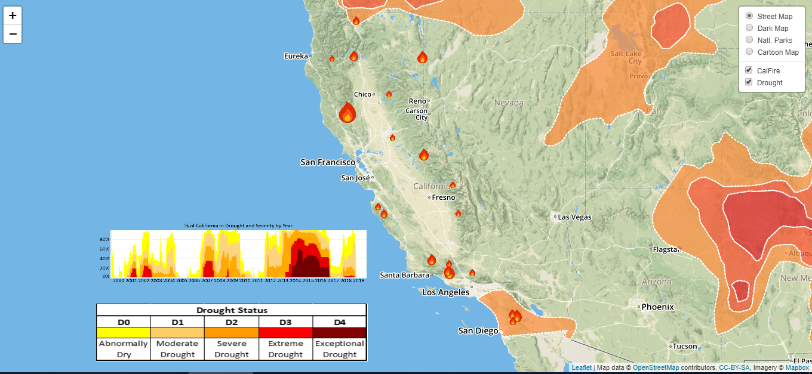

# Drought and Large Widfires in CA

Team project focused on reviewing California wildfire history and current drought conditions. Fire icons  indicate where the 20 largest CA wildfires in history occurred. Size of the icon indicates the acres burned by the fires.  
My responsibility on this team was to help present the project and exclusively work on the drought map visualization.  
 
Tools used: Aeris json, leafletJS, MapBox, javascript, html/css.  
 

